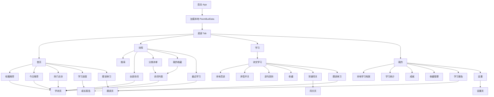
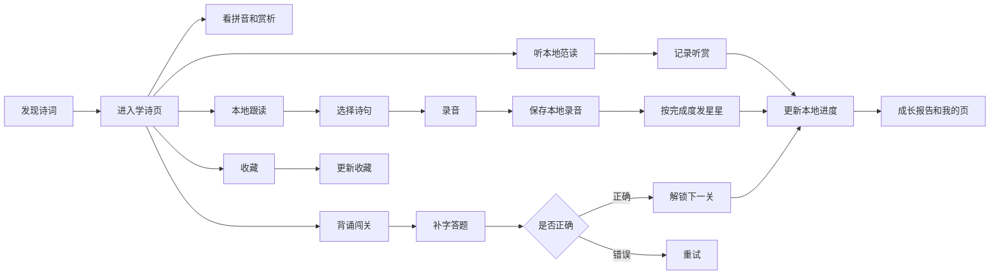
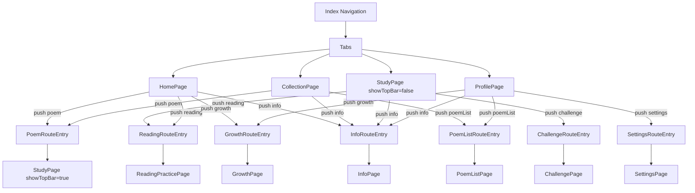
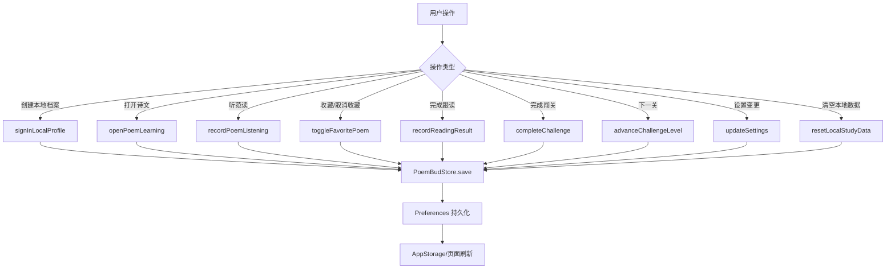
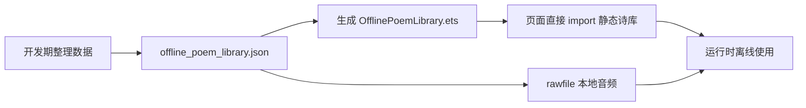

# PoemBud 单机版产品流程

## 1. 信息架构

## 2. 学习闭环

## 3. 路由流程

## 4. 数据写入流程

## 5. 功能分层

| 优先级 | 已落地能力 |
| --- | --- |
| P0 | 离线诗库、本地范读、学诗详情、收藏、跟读录音、本地进度、无联网诗词接口 |
| P1 | 搜索、分类诗单、全部诗词、我的收藏、动态闯关、成长报告 |
| P2 | 拼音默认开关、声音开关、字号、清空本地学习数据、成就和诗单入口 |

## 6. 数据来源流程

