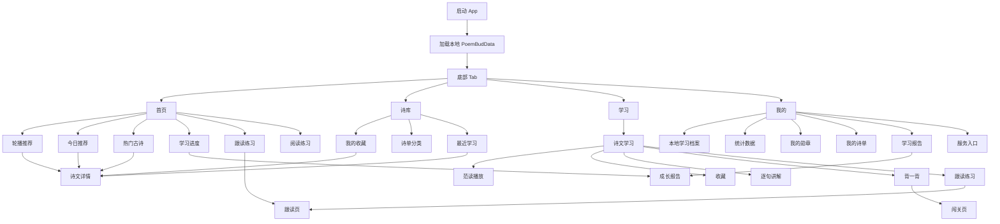
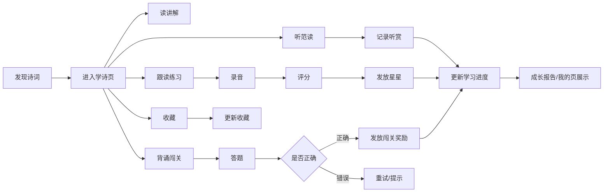
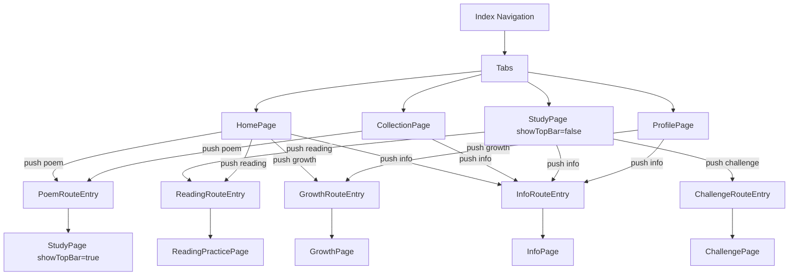
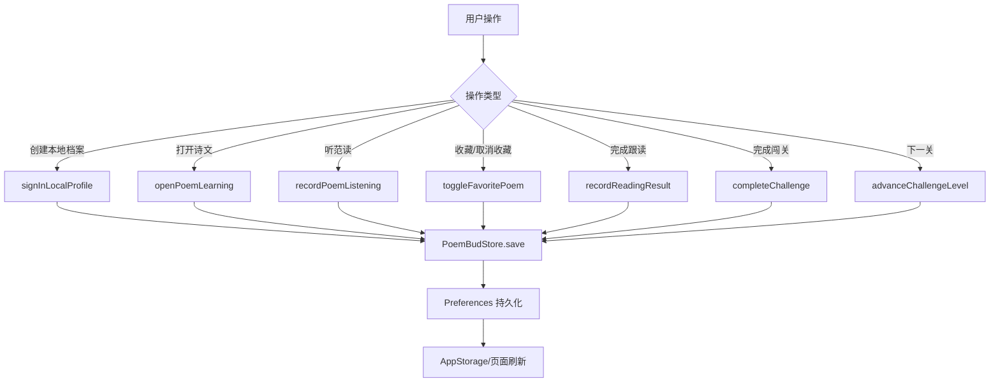
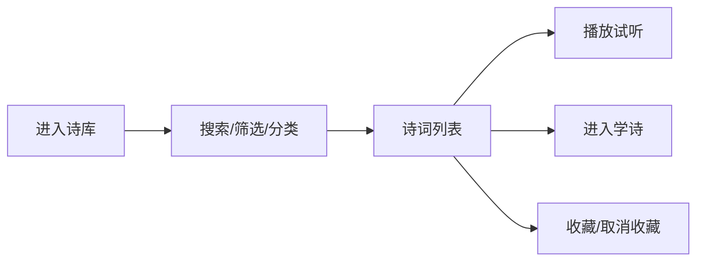
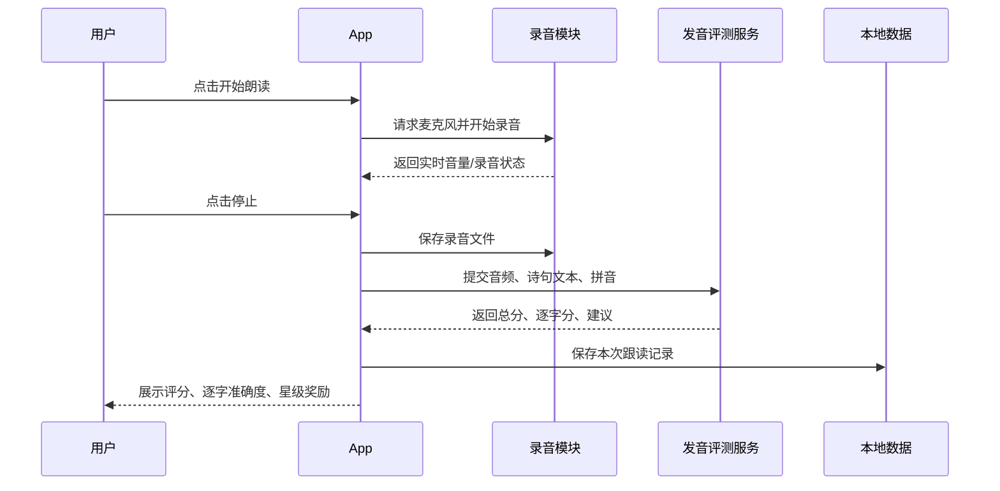
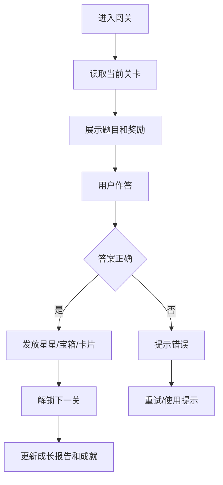
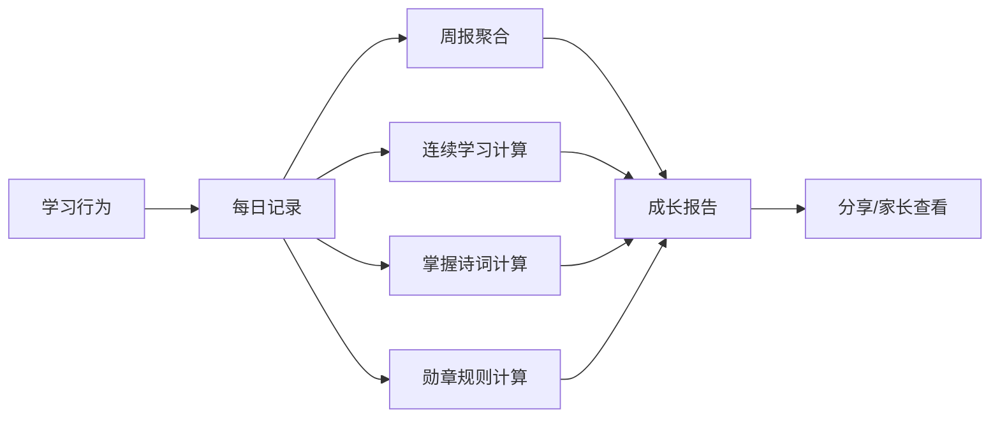
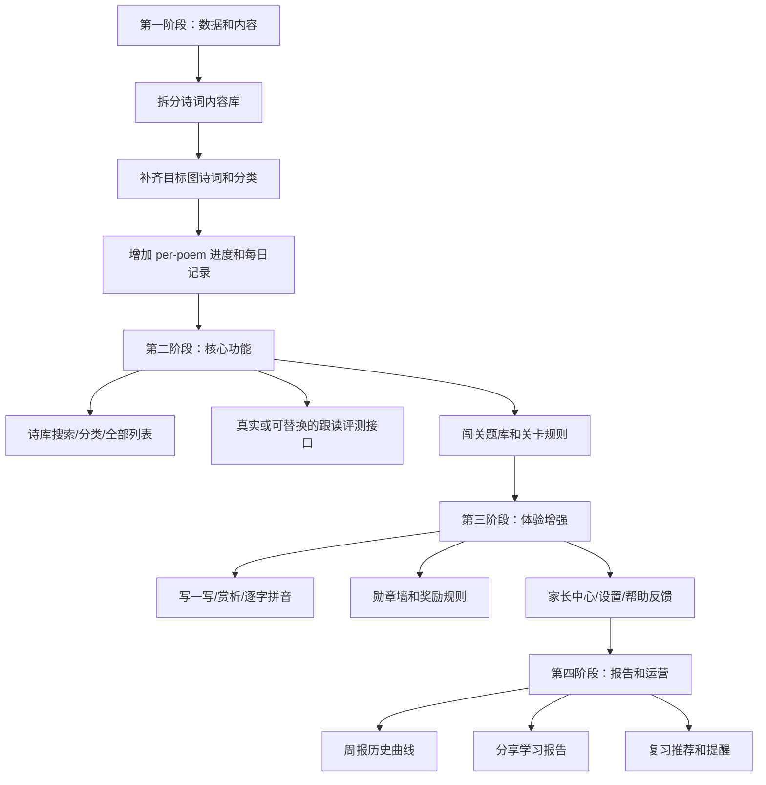

# PoemBud 产品流程

## 1. 总体信息架构

## 2. 学习主闭环

当前实现中：

- “听范读”会调用 `recordPoemListening`，更新最近学习、已学诗、学习分钟和连续学习数据。
- “跟读练习”会调用录音工具保存文件，再调用 `recordReadingResult` 写入分数、星星和成就。
- “背诵闯关”会在答对后调用 `completeChallenge`，更新闯关星、掌握诗数和成就。
- “收藏”会调用 `toggleFavoritePoem`，更新本地收藏 ID 列表。

## 3. 路由流程

## 4. 数据写入流程

## 5. 目标流程与当前缺口

### 5.1 诗库检索流程

目标流程：

当前状态：

- 只有分类卡和最近学习列表。
- 搜索、筛选、分类详情页、全部收藏页未实现。
- 分类点击进入通用说明页。

### 5.2 AI 跟读流程

目标流程：

当前状态：

- 已有麦克风录音和本地文件保存。
- 没有真实 AI 评分，分数固定为 92。
- 没有真实实时波形，只有静态波形数组。
- 没有多次跟读历史。

### 5.3 闯关流程

目标流程：

当前状态：

- 已支持补字题、正确/错误反馈和下一关。
- 题目与关卡没有真正绑定，下一关可能重复同题。
- 没有关卡上限、宝箱、解锁卡片、提示消耗等规则。

### 5.4 成长报告流程

目标流程：

当前状态：

- 成长页已经有展示框架。
- 统计主要来自聚合字段，没有每日历史。
- 周期、曲线、勋章、目标多数是静态或简化计算。

## 6. 建议落地流程

